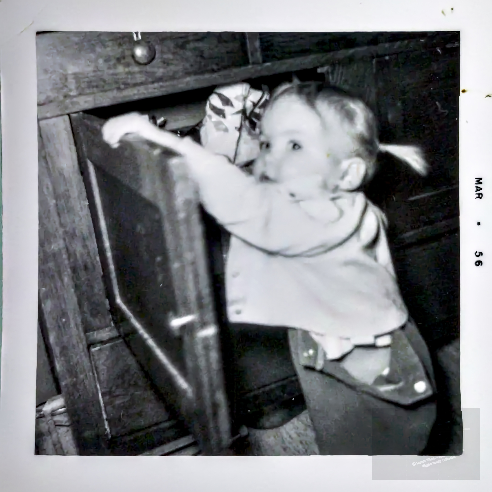

<div align="center">



*Laurie Ward, March 1956 — Higgins Family Collection*

# PhotoIQ

**Batch photo processor for the Higgins Family Collection**

*Rename · Caption · Watermark · Export*

</div>

---

## What It Does

PhotoIQ is a self-hosted web app that runs on your home network. Drop in a batch of photos, add captions, apply a watermark, rename with a consistent scheme, and export everything as a ZIP — all from your browser.

Built for Laurie Ward to archive and protect the Higgins Family Collection.

---

## Features

- **Batch upload** — drag & drop any number of photos at once
- **Contact sheet** — thumbnail grid with multi-select
- **Captions** — burned visibly onto each photo + written to EXIF metadata
- **Watermark** — *© Laurie Ward – Sycamore, Illinois / Higgins Family Collection*, configurable opacity, scale, and angle
- **Rename** — custom prefix + sequential numbering (e.g. `HFC_0001.jpg`)
- **Export** — download a ZIP of processed photos; originals are never touched
- **Delete** — single or batch, with confirmation
- **Persistent** — session survives restarts; photos stay until you remove them

---

## Requirements

- Python 3.10 or higher
- Internet connection for first install only (to pull dependencies)

Check your Python version:
```bash
python3 --version
```

---

## Installation

```bash
git clone https://github.com/richknowles/PhotoIQ.git
cd PhotoIQ
./start.sh
```

That's it. `start.sh` creates a virtual environment, installs all dependencies, and starts the server.

Open your browser to:
```
http://localhost:8000
```

Or from another device on the same network:
```
http://[machine-ip]:8000
```

---

## Watermark Spec

| Setting  | Value                                      |
|----------|--------------------------------------------|
| Text     | © Laurie Ward – Sycamore, Illinois         |
|          | Higgins Family Collection                  |
| Opacity  | 35%                                        |
| Position | Bottom right                               |
| Scale    | ~22% of image width                        |
| Angle    | Straight or angled (selectable)            |

Watermark is applied at **export time only** — originals are always preserved untouched in the `originals/` folder.

---

## Usage

1. **Drop photos** onto the upload area or click to browse
2. **Double-click** any photo to open the editor — rename it, add a caption
3. **Select photos** you want to export (or leave all unselected to export everything)
4. Set your **prefix** and numbering in the toolbar (e.g. `HFC_` → `HFC_0001.jpg`)
5. Toggle **watermark** on/off, adjust opacity/scale/angle as needed
6. Click **Export & Download** → get your ZIP

---

## Stopping the Server

Press `Ctrl+C` in the terminal where it's running.

---

<div align="center">
<sub>Built with ♥ for the Higgins Family · Sycamore, Illinois</sub>
</div>
